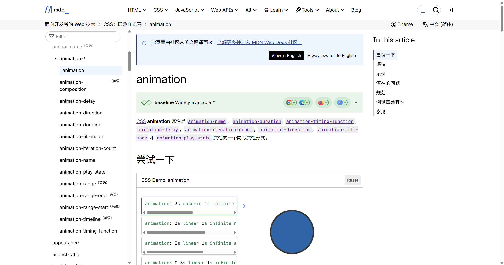
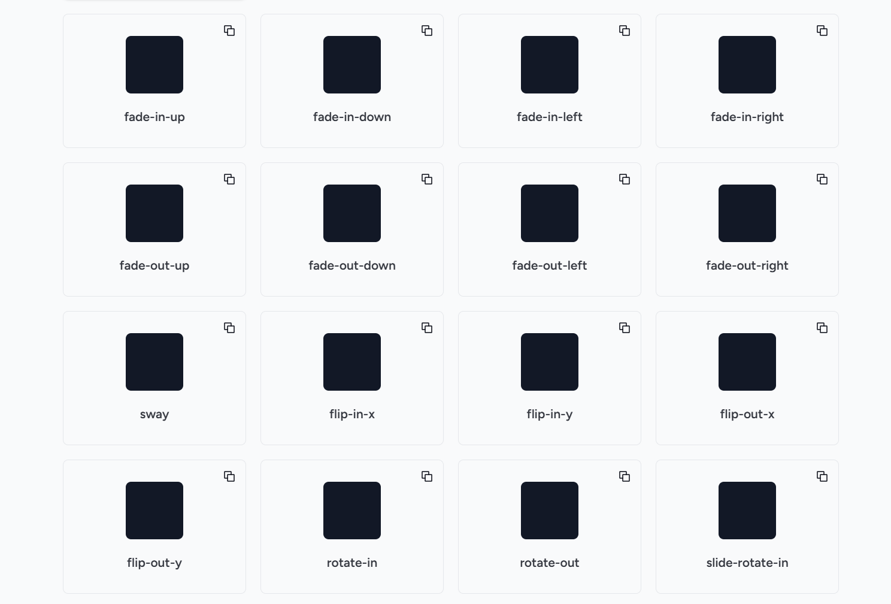
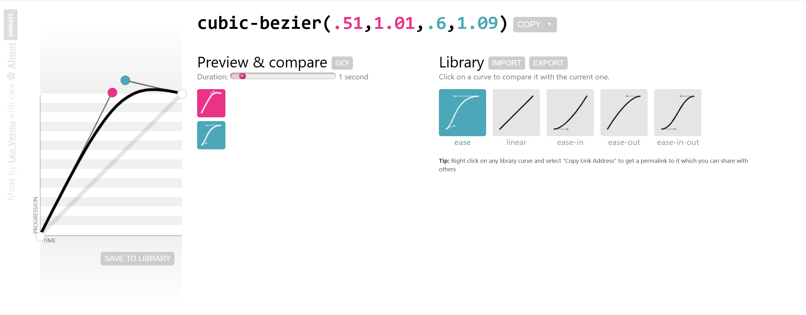
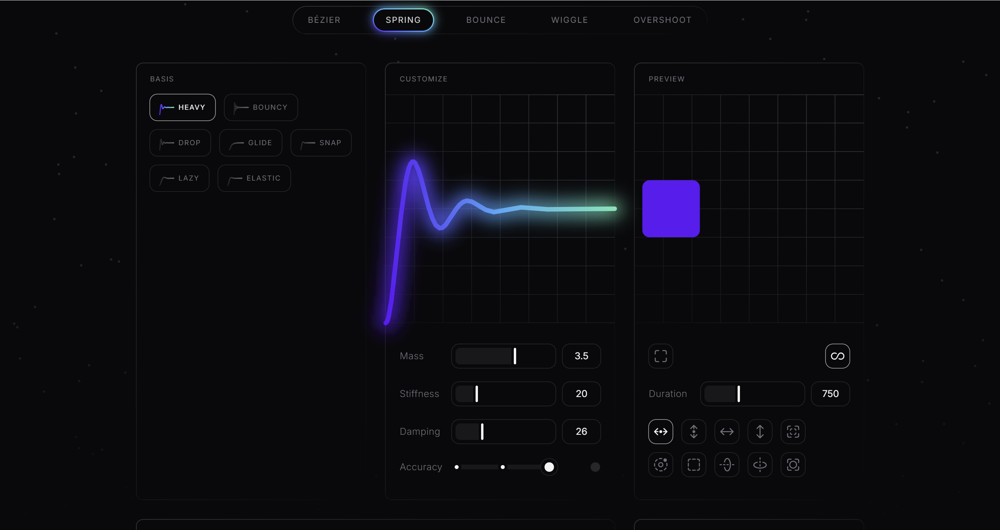

# motion [v12.x]

### 作者: -- 天气预报

### 日期: -- 2025-09-15

[toc]

## 01. css-animation 

> === https://developer.mozilla.org/zh-CN/docs/Web/CSS/animation

- **UI**

### 1.1 @keyframes

> === @keyframes 定义动画关键帧数 from {} | to {} | number% {}

- **index.html**

~~~html
<!doctype html>
<html lang="en">
    <head>
        <meta charset="UTF-8">
        <title>css-animation</title>
    </head>
    

</html>
~~~

### 1.2 animation-

> === animation-* [若多属性简写推荐如下书写顺序]

- [x] animation:
- [x] animation-name
- [x] animation-duration
- [x] animation-timing-function
- [x] animation-delay
- [x] animation-iteration-count
- [x] animation-direction
- [x] animation-fill-mode
- [x] animation-play-state

- **index.html**

~~~html
<!doctype html>
<html lang="en">
    <head>
        <meta charset="UTF-8">
        <title>css-animation</title>
    </head>
    
    <body>
        

    </body>
</html>
~~~

#### 1.2.1 animation-name

> === anima tion-name: 指定 @keyframes 定义的动画名称

- [x] 推荐常用动画命名: https://tailwindcss-animations.vercel.app/

- **css**

~~~css
.box {
    animation-name: slide-rotate-out;
}
~~~

#### 1.2.2 animation-duration

> === animation-duration: 1s | 200ms [必须是正值 或 0]

- **css**

~~~css
.box {
    animation-name: slide-rotate-out;
    animation-duration: 3s;
}
~~~

#### 1.2.3 animation-timing-function

> === animation-timing-function: 定义动画执行速度率

- [x] animation-timing-function: ease; [未定义时默认值]
- [x] animation-timing-function: linear;
- [x] animation-timing-function: ease-in
- [x] animation-timing-function: ease-out
- [x] animation-timing-function: ease-in-out
- [x] animation-timing-function: cubic-bezier(.51,1.01,.6,1.09) [自定义三次贝塞尔曲线]

- **css**

~~~css
.box {
    animation-name: slide-rotate-out;
    animation-duration: 3s;
    /* animation-timing-function: ease; */ 
    animation-timing-function: cubic-bezier(.51, 1.01, .6, 1.09);
}
~~~

> [!note]
>
> - [x] cubic-bezier-online: https://cubic-bezier.com/#.51,1.01,.6,1.09

- **UI**

> [!note]
>
> - [x] spring: https://easingwizard.com/

- **UI**

- **css**

~~~css
.box {
    animation: slide-rotate-out;
    animation-duration: 5s;
    animation-timing-function: 
        linear(0, 0.013 0.6%, 0.05 1.2%, 0.2 2.5%, 0.949 6.7%, 1.2 8.4%, 1.286 9.2%, 1.35 10%, 1.392 				   10.8%, 1.411 11.6%, 1.411 12.2%, 1.401 12.8%, 1.343 14.2%, 1.258 15.5%, 1.016 18.7%,                    0.914 20.4%, 0.856 21.9%, 0.831 23.5%, 0.834 24.7%, 0.858 26.1%, 0.996 30.7%, 1.037                      32.4%, 1.06 33.9%, 1.07 35.4%, 1.061 37.7%, 0.989 43.8%, 0.971 47.2%, 1.012 59.1%, 0.995                70.8%, 1);
}
~~~

#### 1.2.4 animation-delay

> === animation-delay: 1s | 200ms | -1s [负数表示动画提前]

- [x] animation-duration: 3s;
- [x] animation-delay: -1s; 则表示动画提前到 1s 处、只可见后 2s 动画、较少使用

- **css**

~~~css
.box {
    animation-name: slide-rotate-out;
    animation-duration: 3s;
    /* animation-timing-function: ease; */ 
    animation-timing-function: cubic-bezier(.51, 1.01, .6, 1.09);
    animation-delay: 1s;
}
~~~

#### 1.2.5 animation-iteration-count

> === animation-iteration-count: 1 | 2 | infinite [未声明时默认值 1]

- **css**

~~~css
.box {
    animation-name: slide-rotate-out;
    animation-duration: 3s;
    /* animation-timing-function: ease; */ 
    animation-timing-function: cubic-bezier(.51, 1.01, .6, 1.09);
    animation-delay: 1s;
    animation-iteration-count: 1;
}
~~~

#### 1.2.6 animation-direction

> === animation-direction: 动画播放方向 (正 0% -> 100% ) | (反 100% -> 0%)

- [x] animation-direction: normal;    [未声明默认值]
- [x] animation-direction: reverse;   [反向播放 运动函数同时反向]
- [x] animation-direction: alternate;         [动画在偶数次反向播放 仅多次有效]
- [x] animation-direction: alternate-reverse; [动画在奇数次反向播放 仅多次有效]

- **css**

~~~css
.box {
    animation-name: slide-rotate-out;
    animation-duration: 3s;
    /* animation-timing-function: ease; */ 
    animation-timing-function: cubic-bezier(.51, 1.01, .6, 1.09);
    animation-delay: 1s;
    animation-iteration-count: 1;
    animation-direction: reverse;
}
~~~

> [!note]
>
> - [x] animation-iteration-count: 2;
> - [x] animation-direction 不支持镜像动画、reverse | alternate 等都是动画的倒放

- **css [镜像效果]**

~~~css
animation-timing-function: ease;

/* 此处逻辑：一次动画中完成镜像效果 而非在重复动画中完成镜像效果 */
/* 其它思路 linear | ease-in-out */

@keyframes slide-mirror {
    0% 	 { transform: translateX(0);     animation-timing-function: ease; }
    50%  { transform: translateX(200px); animation-timing-function: ease; }
    100% { transform: translateX(0); }
}

.box {
	animation-name: slide-mirror;
    animation-duration: 3s;
    animation-timing-function: ease;
    animation-iteration-count: 2;
}
~~~

#### 1.2.7 animation-fill-mode

> === animation-fill-mode: 将动画关键帧赋予元素

- [x] animation-fill-mode: none;
- [x] animation-fill-mode: forwards;
- [x] animation-fill-mode: backwards;
- [x] animation-fill-mode: both;

1. none     : 未声明时默认值、不会将动画关键帧赋予元素
2. forwards : 将动画结束关键帧 (to | 100%) 赋予元素、或者说元素停留在动画 100% 状态
3. backwards: 将动画第一帧立即作用元素 (from | 0%) 、即使 delay 也生效
4. both     : forwards & backwards

- **css**

~~~css
.box {
    animation-fill-mode: backwards;
    animation-delay: 5s;
}
~~~

#### 1.2.8 animation-play-state

> === running | paused

- [x] animation-play-state: running;
- [x] animation-play-state: paused;

- **css**

~~~css
.box {
    animation: ... ;
    
    &:hover {
        animation-play-state: paused; 
    }
}
~~~

### 1.3 环境

> === 教程均使用 Next + React + Tailwind 示例

#### 1.3.1 安装

> === https://nextjs.org/

- **npm**

~~~apl
npx create-next-app@latest
~~~

- **console**

~~~apl
What is your project named? my-app
Would you like to use TypeScript? [Yes]
Which linter would you like to use? [None]
Would you like to use Tailwind CSS? [Yes]
Would you like your code inside a `src/` directory? [Yes]
Would you like to use App Router? (recommended) [Yes]
Would you like to use Turbopack? (recommended) [Yes]
Would you like to customize the import alias (`@/*` by default)? [Yes]
What import alias would you like configured? @/*
~~~

#### 1.3.2 项目约定

> === 示例总是在 page.tsx 路由根组件 中完成

-  **globals.css**

~~~css
@import url("https://fonts.googleapis.com/css2?family=Inter:ital,opsz,wght@0,14..32,100..900;1,14..32,100..900&display=swap");

@import "tailwindcss";

@theme {
    --font-inter: Inter;
}
~~~

- **layout.tsx**

~~~tsx
import "./globals.css";

import * as React from "react";

interface RootLayoutProps {
    children: Readonly<React.ReactNode>;
}

export default function RootLayout({ children }: RootLayoutProps) {
    return (
        <html lang="en">
            <body>
                { children }
            </body>
        </html>
    )
}
~~~

- **page.tsx**

~~~tsx
export default function Page() {
    return (
        

            <h1 className="font-inter text-white">
                

                    A journey of a thousand miles begins with a single step.
                

            </h1>
        

    )
}
~~~

### 1.4 tailwind

> === https://tailwindcss.com/docs/animation

- [x] animate-spin | animate-ping | animate-pulse | animate-bounce | animate-none

#### 1.4.1 animate-spin

> === 内置旋转动画

- **css**

~~~css
@keyframes spin {
	to {
		transform: rotate(360deg);
	}
}

/* 主题变量 */

@theme {
    --animate-spin: spin 1s linear infinite;
}
~~~

- **page.tsx**

~~~tsx
export default function Page() {
    return (
        

            

                

                

            

        

    )
}
~~~

#### 1.4.2 animate-ping

> === 内置缩放元素动画

- **css**

~~~css
@keyframes ping {
    75%, 100% {
        transform: scale(2);
        opacity: 0;
    }
}

/* 主题变量 */

@theme {
    --animate-ping: ping 1s cubic-bezier(0, 0, 0.2, 1) infinite; 
}
~~~

 

- **page.tsx**

~~~tsx
export default function Page() {
    return (
        

            

                

                    

                

                

                    

                

            

        

    )
}
~~~

#### 1.4.3 animate-pulse

> === 内置脉冲闪烁

- **css**

~~~css
@keyframes pulse {
    50% {
    	opacity: 0.5;
    }
}

@theme {
    --animate-pulse: pulse 2s cubic-bezier(0.4, 0, 0.6, 1) infinite; 
}
~~~

- **page.tsx**

~~~tsx
export default function Page() {
    return (
        

            

        

    )
}
~~~

#### 1.4.4 animate-bounce

> === 上下跳动

- **css**

~~~css
@keyframes bounce {
    0%, 100% {
    	transform: translateY(-25%);
    	animation-timing-function: cubic-bezier(0.8, 0, 1, 1);
    }
    50% {
    	transform: none;
    	animation-timing-function: cubic-bezier(0, 0, 0.2, 1);
    }
}

@theme {
     --animate-bounce: bounce 1s infinite;
}
~~~

- **page.tsx**

~~~tsx
export default function Page() {
    return (
        

            

        

    )
}
~~~

#### 1.4.5 custom

> === @theme { @keyframes name { } } 块中定义动画行为

- **globals.css**

~~~css
@import "tailwindcss";

@theme {

    @keyframes slide {
        from {
            opacity: 0;
            transform: translateX(0px) rotate(0deg);
        }
        to {
            opacity: 1;
            transform: translateX(480px) rotate(360deg);
        }
    }

    --animate-slide: slide 1s ease-in-out forwards;
}
~~~

- **page.tsx**

~~~tsx
export default function Page() {
    return (
        

            

        

    )
}
~~~

#### 1.4.6 animation-delay

> === tailwind [v4.1] 没有内置 animation-delay 实用工具类

- **css**

~~~css
@import url("https://fonts.googleapis.com/css2?family=Inter:ital,opsz,wght@0,14..32,100..900;1,14..32,100..900&display=swap");
@import "tailwindcss";

@theme {
    --font-inter: Inter;

    @keyframes slide {
        from {
            opacity: 0;
            transform: translateX(0px) rotate(0deg);
        }
        to {
            opacity: 1;
            transform: translateX(480px) rotate(360deg);
        }
    }

    --animate-slide: slide 1s ease-in-out forwards;
}

@utility animate-delay-* {
    animation-delay: calc(--value(integer) * 1ms);
}
~~~

- **page.tsx**

~~~tsx
export default function Page() {
    return (
        

            

                

                

            

        

    )
}
~~~

#### 1.4.7 animation-play-state

> ===  tailwind [v4.1] 没有内置 animation-play-state 实用工具类

- **css**

~~~css
@import url("https://fonts.googleapis.com/css2?family=Inter:ital,opsz,wght@0,14..32,100..900;1,14..32,100..900&display=swap");
@import "tailwindcss";

@theme {
    --font-inter: Inter;

    @keyframes slide {
        from {
            opacity: 0;
            transform: translateX(0px) rotate(0deg);
        }
        to {
            opacity: 1;
            transform: translateX(480px) rotate(360deg);
        }
    }

    --animate-slide: slide 1s ease-in-out forwards;
}

@utility animate-delay-* {
    animation-delay: calc(--value(integer) * 1ms);
}

@utility animate-paused {
    animation-play-state: paused;
}

@utility animate-running {
    animation-play-state: running;
}
~~~

- **page.tsx**

~~~tsx
export default function Page() {
    return (
        

            

        

    )
}
~~~

