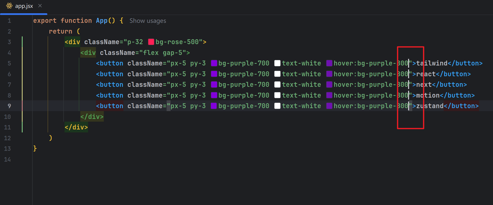

# Tailwind [v4.1]

### 作者: -- 天气预报

### 日期: -- 2025-09-20

## 01. 官网

> === https://tailwindcss.com/

- **ui**

> [!note]
>
> - [x] Tailwind (v4.1) 推荐新项目直接使用即可

### 1.1 官方文档

> === https://tailwindcss.com/docs/installation/using-vite

- **ui**

- **ui**

### 1.2 在线运行

> === https://play.tailwindcss.com/

- **ui**

### 1.3 福利课程

> === https://tailwindcss.com/course

- [x] 邮件报名、邮件推送油管视频 [科学上网] (* 小课程、分享特殊场景案例实现)

### 1.4 付费服务

> === https://tailwindcss.com/plus/templates?ref=sidebar

- **ui**

### 1.5 官方组件

> === https://tailwindcss.com/plus/ui-blocks?ref=sidebar

- [x] 免费

- **ui**

- **ui**

### 1.6 博客新闻

> === https://tailwindcss.com/blog

- **ui**

### 1.7 社区插件

> === https://tailscan.com/

- **ui**

> === Tailscan Core | Tailscan Core + AI

- **ui**

- **ui**

- **ui**

## 02. 环境

> === https://tailwindcss.com/docs/installation/using-vite

- **ui**

### 2.1 CDN

> === https://tailwindcss.com/docs/installation/play-cdn

- **index.html**

~~~html
<!DOCTYPE html>
<html lang="en">
    <head>
        <meta charset="UTF-8">
        <title>Tailwind</title>
        
        
    </head>
    <body>
        

            <h1 class="text-2xl text-center text-white">tailwind</h1>
        

    </body>
</html>
~~~

### 2.2 Tailwind CLI

> === https://tailwindcss.com/docs/installation/tailwind-cli

- **npm**

~~~apl
npm init --yes

npm install tailwindcss @tailwindcss/cli
~~~

- **src/input.css**

~~~css
@import "tailwindcss";
~~~

- **src/index.html**

~~~html
<!DOCTYPE html>
<html lang="en">
    <head>
        <meta charset="UTF-8">
        <title>Tailwind</title>
        <link rel="stylesheet" href="./output.css">
    </head>
    <body>
        

            <h1 class="text-2xl text-center text-white">tailwind</h1>
        

    </body>
</html>
~~~

- **npx**

~~~apl
npx @tailwindcss/cli -i ./src/input.css -o ./src/output.css --watch
~~~

### 2.3 Next

> === https://nextjs.org/

- [x] 内置安装引导支持、仅需创建项目时选中即可

- **npm**

~~~apl
npx create-next-app@latest
~~~

- **console**

~~~apl
# 项目名称
1. What is your project named? [name]

# 是否安装 TypeScript
2. Would you like to use TypeScript? [No / Yes]

# 是否安装 ESLint 代码检查工具
3. Which linter would you like to use? [ESLint / Biome / None]

# 是否安装 Tailwind
4. Would you like to use Tailwind CSS? No / Yes

# 是否需要 src 作为项目源代码存放目录
5. Would you like your code inside a `src/` directory? [No / Yes]

# 是否安装 文件路由系统
6. Would you like to use App Router? (recommended) [No / Yes]

# 是否安装 Turbopack 打包构建工具
7. Would you like to use Turbopack? (recommended) [No / Yes]

# 是否配置 @/* 别名 模块导入方式
8. Would you like to customize the import alias (`@/*` by default)? [No / Yes]

# 配置别名 是否使用 @/*
9. What import alias would you like configured? @/*
~~~

- **page.tsx**

~~~tsx
export default function Page() {
    return (
        

            <h1 className="text-2xl text-white text-center">tailwind</h1>
        

    )
}
~~~

### 2.4 Vite React

> === 请认真学习本节示例过程、后续示例基于此环境、本环境无须掌握 React

#### 2.4.1 init

> === npm init --yes

- **package.json**

~~~json
{
    "name": "tailwind",
    "version": "1.0.0",
    "scripts": {
        "test": "echo \"Error: no test specified\" && exit 1"
    },
    "keywords": [],
    "author": "",
    "license": "ISC",
    "description": "",
    "type": "module"
}
~~~

#### 2.4.2 react

> === npm install react react-dom

- **package.json**

~~~json
{
    "name": "tailwind",
    "version": "1.0.0",
    "main": "index.js",
    "scripts": {
        "test": "echo \"Error: no test specified\" && exit 1"
    },
    "keywords": [],
    "author": "",
    "license": "ISC",
    "description": "",
    "type": "module",
    "dependencies": {
        "react": "^19.1.1",
        "react-dom": "^19.1.1"
    }
}
~~~

#### 2.4.3 vite

> === npm install vite -D

- **package.json**

~~~json
{
    "name": "tailwind",
    "version": "1.0.0",
    "main": "index.js",
    "scripts": {
        "test": "echo \"Error: no test specified\" && exit 1"
    },
    "keywords": [],
    "author": "",
    "license": "ISC",
    "description": "",
    "type": "module",
    "dependencies": {
        "react": "^19.1.1",
        "react-dom": "^19.1.1"
    },
    "devDependencies": {
        "vite": "^7.1.6"
    }
}
~~~

#### 2.4.4 plugin-react

> === https://cn.vite.dev/plugins/

- [x] npm install @vitejs/plugin-react     -D
- [x] npm install @vitejs/plugin-react-swc -D  [https://swc.rs/ ]

- **package.json**

~~~json
{
    "name": "tailwind",
    "version": "1.0.0",
    "main": "index.js",
    "scripts": {
        "test": "echo \"Error: no test specified\" && exit 1"
    },
    "keywords": [],
    "author": "",
    "license": "ISC",
    "description": "",
    "type": "module",
    "dependencies": {
        "react": "^19.1.1",
        "react-dom": "^19.1.1"
    },
    "devDependencies": {
        "@vitejs/plugin-react-swc": "^4.1.0",
        "vite": "^7.1.6"
    }
}
~~~

#### 2.4.5 vite.config.js

> === 项目根目录创建 vite.config.js 文件

- **vite.config.js**

~~~js
import { defineConfig } from "vite";
import react from "@vitejs/plugin-react-swc";

export default defineConfig({
    plugins: [
        react(),
    ]
})
~~~

#### 2.4.6 index.html

> === 项目根目录创建文件 index.html

~~~html
<!DOCTYPE html>
<html lang="en">
    <head>
        <meta charset="UTF-8">
        <title>React</title>
    </head>
    <body>
        

        
    </body>
</html>
~~~

#### 2.4.7 src/main.jsx

> === 项目根目录创建目录及文件 src/app.jsx | src/main.jsx

- **src/app.jsx**

~~~jsx
export function App() {
    return (
        
react

    )
}
~~~

- **src/main.jsx**

~~~jsx
import { createRoot } from "react-dom/client";
import { App } from "./app.jsx";

const root = document.getElementById("root");

createRoot(root).render(<App/>);
~~~

- **package.json**

~~~json
{
    "name": "tailwind",
    "version": "1.0.0",
    "scripts": {
        "dev": "vite dev"
    },
    "keywords": [],
    "author": "",
    "license": "ISC",
    "description": "",
    "type": "module",
    "dependencies": {
        "react": "^19.1.1",
        "react-dom": "^19.1.1"
    },
    "devDependencies": {
        "@vitejs/plugin-react-swc": "^4.1.0",
        "vite": "^7.1.6"
    }
}
~~~

- **npm**

~~~apl
npm run dev # http://localhost:5173/
~~~

#### 2.4.8 tailwind

> === npm install tailwindcss @tailwindcss/vite -D

- **package.json**

~~~json
{
    "name": "tailwind",
    "version": "1.0.0",
    "scripts": {
        "dev": "vite dev"
    },
    "keywords": [],
    "author": "",
    "license": "ISC",
    "description": "",
    "type": "module",
    "dependencies": {
        "react": "^19.1.1",
        "react-dom": "^19.1.1"
    },
    "devDependencies": {
        "@tailwindcss/vite": "^4.1.13",
        "@vitejs/plugin-react-swc": "^4.1.0",
        "tailwindcss": "^4.1.13",
        "vite": "^7.1.6"
    }
}
~~~

- **vite.config.js**

~~~js
import { defineConfig } from "vite";
import react from "@vitejs/plugin-react-swc";
import tailwindcss from "@tailwindcss/vite";

export default defineConfig({
    plugins: [
        react(),
        tailwindcss(),
    ]
})
~~~

- **src/globals.css**

~~~css
@import "tailwindcss";
~~~

- **src/main.jsx**

~~~jsx
import { createRoot } from "react-dom/client";
import { App } from "./app.jsx";
import "./globals.css";

const root = document.getElementById("root");
createRoot(root).render(<App/>)
~~~

- **src/app.jsx**

~~~jsx
export function App() {
    return (
        

            <h1 className="font-mono text-center text-white">
                
                    tailwind
                
            </h1>
        

    )
}
~~~

## 03. 开发工具

> === https://tailwindcss.com/docs/editor-setup

### 3.1 IDE

- **ui**

> === WebStorm 内置 Tailwind Language Server 语言服务引擎

- [x] 引擎自动开启、无需其它配置、可自动提示 Tailwind、可检测类选择器

- **ui**

- **ui**

> === 列编辑: ALT + SHIFT + INSERT [二次按下为取消列编辑状态]

- **ui**

### 3.2 格式化

> === https://github.com/tailwindlabs/prettier-plugin-tailwindcss

- **ui**

- **npm**

~~~apl
npm install prettier prettier-plugin-tailwindcss -D
~~~

- **prettier.config.js**

~~~js
export default {
	plugins: ["prettier-plugin-tailwindcss"],
}
~~~

- **npx**

~~~apl
npx prettier . --write
~~~

> === 推荐人为控制书写顺序 [位置 | 盒子模型 | 排版 | 视觉 | 其它]

- **src/app.jsx**

~~~jsx
export function App() {
    return (
        

            

                

            

        

    )
}
~~~

> [!note]
>
> - [x] https://codeguide.bootcss.com/

- **ui**

### 3.3 兼容性

> === https://tailwindcss.com/docs/compatibility

- **ui**

## 04. 样式初始化

> === https://tailwindcss.com/docs/preflight

