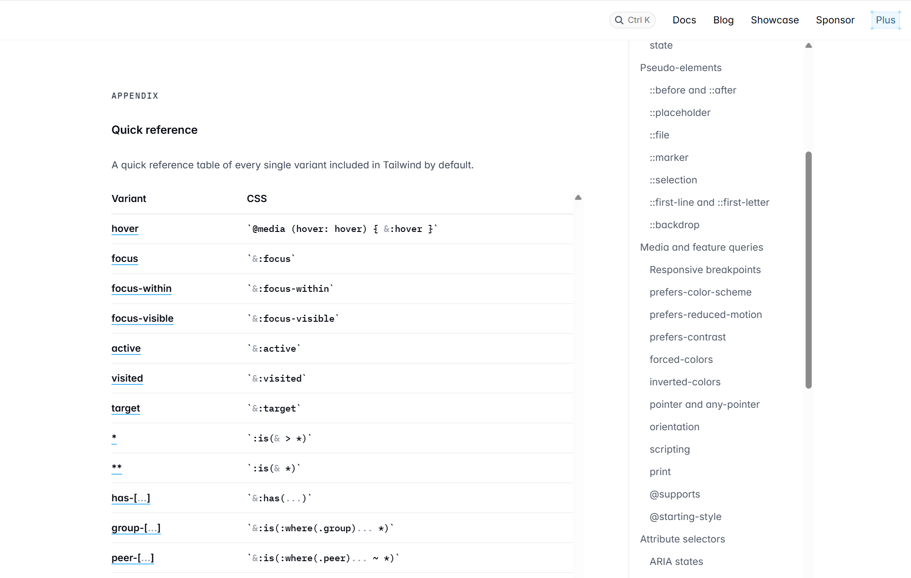
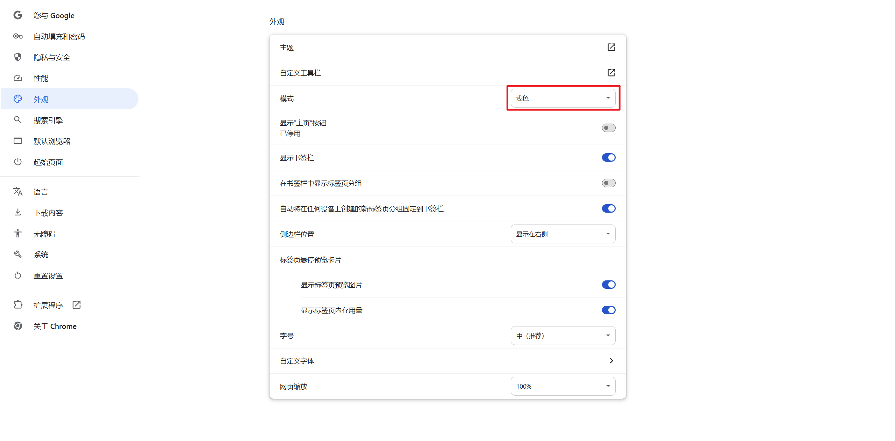
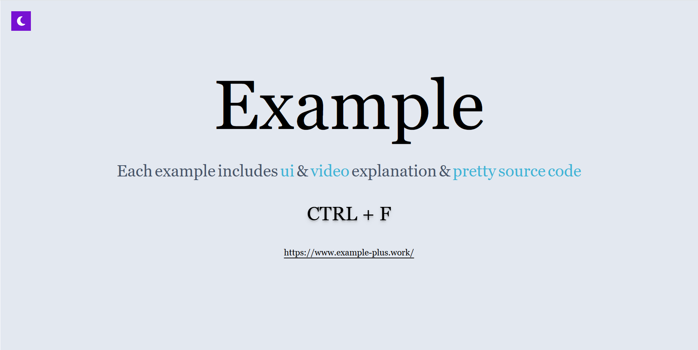
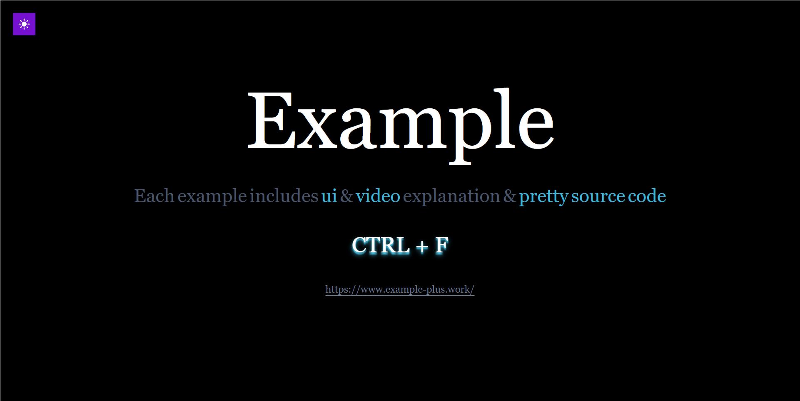
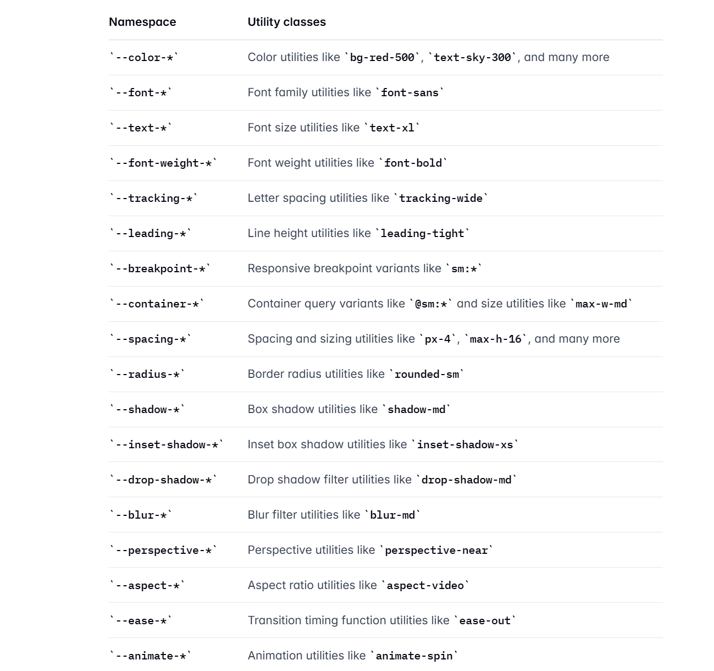
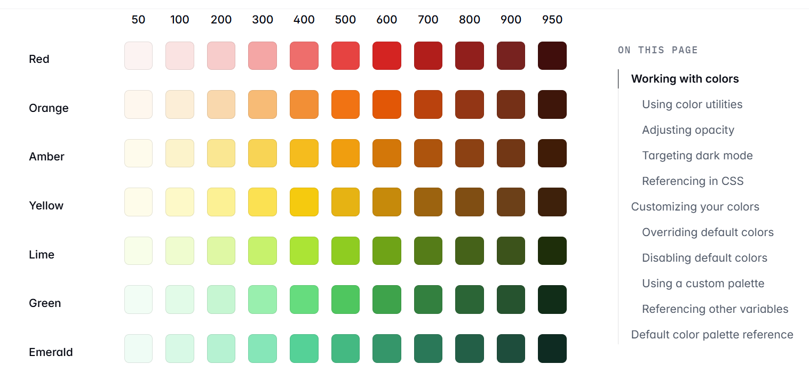

# Tailwind [v4.1]

### 作者: -- 天气预报

### 日期: -- 2025-09-20

 

## 01. 官网

> === https://tailwindcss.com/

- **ui**

> [!note]
>
> - [x] Tailwind (v4.1) 推荐新项目直接使用即可

### 1.1 文档

> === https://tailwindcss.com/docs/installation/using-vite

- **ui**

- **ui**

### 1.2 在线运行

> === https://play.tailwindcss.com/

- **ui**

### 1.3 福利课程

> === https://tailwindcss.com/course

- [x] 邮件报名、邮件推送油管视频 [科学上网] (* 小课程、分享特殊场景案例实现)

### 1.4 模版服务

> === https://tailwindcss.com/plus/templates?ref=sidebar

- **ui**

### 1.5 组件

> === https://tailwindcss.com/plus/ui-blocks?ref=sidebar

- [x] 免费

- **ui**

- **ui**

### 1.6 博客

> === https://tailwindcss.com/blog

- **ui**

### 1.7 插件

> === https://tailscan.com/

- **ui**

> === Tailscan Core | Tailscan Core + AI

- **ui**

- **ui**

- **ui**

## 02. 环境

> === https://tailwindcss.com/docs/installation/using-vite

- **ui**

### 2.1 CDN

> === https://tailwindcss.com/docs/installation/play-cdn

- **index.html**

~~~html
<!DOCTYPE html>
<html lang="en">
    <head>
        <meta charset="UTF-8">
        <title>Tailwind</title>
        
        
    </head>
    <body>
        

            <h1 class="text-2xl text-center text-white">tailwind</h1>
        

    </body>
</html>
~~~

### 2.2 Tailwind CLI

> === https://nodejs.org/zh-cn

- **ui**

> === https://tailwindcss.com/docs/installation/tailwind-cli

- **npm**

~~~apl
npm init --yes

npm install tailwindcss @tailwindcss/cli
~~~

- **src/input.css**

~~~css
@import "tailwindcss";
~~~

- **src/index.html**

~~~html
<!DOCTYPE html>
<html lang="en">
    <head>
        <meta charset="UTF-8">
        <title>Tailwind</title>
        <link rel="stylesheet" href="./output.css">
    </head>
    <body>
        

            <h1 class="text-2xl text-center text-white">tailwind</h1>
        

    </body>
</html>
~~~

- **npx**

~~~apl
npx @tailwindcss/cli -i ./src/input.css -o ./src/output.css --watch
~~~

### 2.3 Next

> === https://nextjs.org/

- [x] 内置安装引导支持、仅需创建项目时选中即可

- **npm**

~~~apl
npx create-next-app@latest
~~~

- **console**

~~~apl
# 项目名称
1. What is your project named? [name]

# 是否安装 TypeScript
2. Would you like to use TypeScript? [No / Yes]

# 是否安装 ESLint 代码检查工具
3. Which linter would you like to use? [ESLint / Biome / None]

# 是否安装 Tailwind
4. Would you like to use Tailwind CSS? No / Yes

# 是否需要 src 作为项目源代码存放目录
5. Would you like your code inside a `src/` directory? [No / Yes]

# 是否安装 文件路由系统
6. Would you like to use App Router? (recommended) [No / Yes]

# 是否安装 Turbopack 打包构建工具
7. Would you like to use Turbopack? (recommended) [No / Yes]

# 是否配置 @/* 别名 模块导入方式
8. Would you like to customize the import alias (`@/*` by default)? [No / Yes]

# 配置别名 是否使用 @/*
9. What import alias would you like configured? @/*
~~~

- **page.tsx**

~~~tsx
export default function Page() {
    return (
        

            <h1 className="text-2xl text-white text-center">tailwind</h1>
        

    )
}
~~~

### 2.4 Vite React

> === 请认真学习本节示例过程、后续示例基于此环境、本环境无须掌握 React

#### 2.4.1 init

> === npm init --yes

- **package.json**

~~~json
{
    "name": "tailwind",
    "version": "1.0.0",
    "scripts": {
        "test": "echo \"Error: no test specified\" && exit 1"
    },
    "keywords": [],
    "author": "",
    "license": "ISC",
    "description": "",
    "type": "module"
}
~~~

#### 2.4.2 react

> === npm install react react-dom

- **package.json**

~~~json
{
    "name": "tailwind",
    "version": "1.0.0",
    "main": "index.js",
    "scripts": {
        "test": "echo \"Error: no test specified\" && exit 1"
    },
    "keywords": [],
    "author": "",
    "license": "ISC",
    "description": "",
    "type": "module",
    "dependencies": {
        "react": "^19.1.1",
        "react-dom": "^19.1.1"
    }
}
~~~

#### 2.4.3 vite

> === npm install vite -D

- **package.json**

~~~json
{
    "name": "tailwind",
    "version": "1.0.0",
    "main": "index.js",
    "scripts": {
        "test": "echo \"Error: no test specified\" && exit 1"
    },
    "keywords": [],
    "author": "",
    "license": "ISC",
    "description": "",
    "type": "module",
    "dependencies": {
        "react": "^19.1.1",
        "react-dom": "^19.1.1"
    },
    "devDependencies": {
        "vite": "^7.1.6"
    }
}
~~~

#### 2.4.4 plugin-react

> === https://cn.vite.dev/plugins/

- [x] npm install @vitejs/plugin-react     -D
- [x] npm install @vitejs/plugin-react-swc -D  [https://swc.rs/ ]

- **package.json**

~~~json
{
    "name": "tailwind",
    "version": "1.0.0",
    "main": "index.js",
    "scripts": {
        "test": "echo \"Error: no test specified\" && exit 1"
    },
    "keywords": [],
    "author": "",
    "license": "ISC",
    "description": "",
    "type": "module",
    "dependencies": {
        "react": "^19.1.1",
        "react-dom": "^19.1.1"
    },
    "devDependencies": {
        "@vitejs/plugin-react-swc": "^4.1.0",
        "vite": "^7.1.6"
    }
}
~~~

#### 2.4.5 vite.config.js

> === 项目根目录创建 vite.config.js 文件

- **vite.config.js**

~~~js
import { defineConfig } from "vite";
import react from "@vitejs/plugin-react-swc";

export default defineConfig({
    plugins: [
        react(),
    ]
})
~~~

#### 2.4.6 index.html

> === 项目根目录创建文件 index.html

~~~html
<!DOCTYPE html>
<html lang="en">
    <head>
        <meta charset="UTF-8">
        <title>React</title>
    </head>
    <body>
        

        
    </body>
</html>
~~~

#### 2.4.7 src/main.jsx

> === 项目根目录创建目录及文件 src/app.jsx | src/main.jsx

- **src/app.jsx**

~~~jsx
export function App() {
    return (
        
react

    )
}
~~~

- **src/main.jsx**

~~~jsx
import { createRoot } from "react-dom/client";
import { App } from "./app.jsx";

const root = document.getElementById("root");

createRoot(root).render(<App/>);
~~~

- **package.json**

~~~json
{
    "name": "tailwind",
    "version": "1.0.0",
    "scripts": {
        "dev": "vite dev"
    },
    "keywords": [],
    "author": "",
    "license": "ISC",
    "description": "",
    "type": "module",
    "dependencies": {
        "react": "^19.1.1",
        "react-dom": "^19.1.1"
    },
    "devDependencies": {
        "@vitejs/plugin-react-swc": "^4.1.0",
        "vite": "^7.1.6"
    }
}
~~~

- **npm**

~~~apl
npm run dev # http://localhost:5173/
~~~

#### 2.4.8 tailwind

> === npm install tailwindcss @tailwindcss/vite -D

- **package.json**

~~~json
{
    "name": "tailwind",
    "version": "1.0.0",
    "scripts": {
        "dev": "vite dev"
    },
    "keywords": [],
    "author": "",
    "license": "ISC",
    "description": "",
    "type": "module",
    "dependencies": {
        "react": "^19.1.1",
        "react-dom": "^19.1.1"
    },
    "devDependencies": {
        "@tailwindcss/vite": "^4.1.13",
        "@vitejs/plugin-react-swc": "^4.1.0",
        "tailwindcss": "^4.1.13",
        "vite": "^7.1.6"
    }
}
~~~

- **vite.config.js**

~~~js
import { defineConfig } from "vite";
import react from "@vitejs/plugin-react-swc";
import tailwindcss from "@tailwindcss/vite";

export default defineConfig({
    plugins: [
        react(),
        tailwindcss(),
    ]
})
~~~

- **src/globals.css**

~~~css
@import "tailwindcss";
~~~

- **src/main.jsx**

~~~jsx
import { createRoot } from "react-dom/client";
import { App } from "./app.jsx";
import "./globals.css";

const root = document.getElementById("root");
createRoot(root).render(<App/>)
~~~

- **src/app.jsx**

~~~jsx
export function App() {
    return (
        

            <h1 className="font-mono text-center text-white">
                
                    tailwind
                
            </h1>
        

    )
}
~~~

## 03. 开发工具

> === https://tailwindcss.com/docs/editor-setup

### 3.1 IDE

- **ui**

> === WebStorm 内置 Tailwind Language Server 语言服务引擎

- [x] 推荐最新版本: https://www.jetbrains.com/webstorm/download/other.html
- [x] 引擎自动开启、无需其它配置、可自动提示 Tailwind、可检测类选择器

- **ui**

- **ui**

### 3.2 格式化

> === https://github.com/tailwindlabs/prettier-plugin-tailwindcss

- **ui**

- **npm**

~~~apl
npm install prettier prettier-plugin-tailwindcss -D
~~~

- **prettier.config.js**

~~~js
export default {
	plugins: ["prettier-plugin-tailwindcss"],
}
~~~

- **npx**

~~~apl
npx prettier . --write
~~~

> === 推荐人为控制书写顺序 [位置 | 盒子模型 | 排版 | 视觉 | 其它]

- **src/app.jsx**

~~~jsx
export function App() {
    return (
        

            

                

            

        

    )
}
~~~

> [!note]
>
> - [x] https://codeguide.bootcss.com/

- **ui**

### 3.3 兼容性

> === https://tailwindcss.com/docs/compatibility

- **ui**

## 04. 样式初始化

> === https://tailwindcss.com/docs/preflight

### 4.1 modern-normaliz

> === https://github.com/sindresorhus/modern-normalize

- [x] Tailwind 使用 modern-normaliz 初始化 HTML 及常用元素样式初始化
- [x] node_modules/tailwindcss/preflight.css

- **ui**

- **preflight.css**

~~~css
*,
::after,
::before,
::backdrop,
::file-selector-button {
    box-sizing: border-box;
    margin: 0;
    padding: 0;
    border: 0 solid;
}

h1,
h2,
h3,
h4,
h5,
h6 {
    font-size: inherit;
    font-weight: inherit;
}

img,
svg,
video,
canvas,
audio,
iframe,
embed,
object {
    display: block; /* 1 */
    vertical-align: middle; /* 2 */
}
~~~

### 4.2 @layer

> === Tailwind 内置 theme | base | components | utilities 分层全局管理样式

- **globals.css**

~~~css
@import "tailwindcss";
~~~

- **globals.css**

~~~css
@layer theme, base, components, utilities;

@import "tailwindcss/theme.css" layer(theme);
@import "tailwindcss/preflight.css" layer(base);
@import "tailwindcss/utilities.css" layer(utilities);
~~~

### 4.3 @layer theme

> === 主题层定义 Tailwind 内置各种全局变量、颜色、动画、间距 等 ...

- **node_modules/tailwindcss/theme.css**

~~~css
@theme default {
    
    --color-red-50: oklch(97.1% 0.013 17.38);
    --color-red-100: oklch(93.6% 0.032 17.717);
    --color-red-200: oklch(88.5% 0.062 18.334);
    --color-red-300: oklch(80.8% 0.114 19.571);
    --color-red-400: oklch(70.4% 0.191 22.216);
    --color-red-500: oklch(63.7% 0.237 25.331);
    --color-red-600: oklch(57.7% 0.245 27.325);
    --color-red-700: oklch(50.5% 0.213 27.518);
    --color-red-800: oklch(44.4% 0.177 26.899);
    --color-red-900: oklch(39.6% 0.141 25.723);
    --color-red-950: oklch(25.8% 0.092 26.042);

    --blur-xs: 4px;
    --blur-sm: 8px;
    --blur-md: 12px;
    --blur-lg: 16px;
    --blur-xl: 24px;
    --blur-2xl: 40px;
    --blur-3xl: 64px;
    
    --spacing: 0.25rem; // html 16px * 0.25 ==> 4px
                        //              w-5 ==> width: 20px
                        //              p-5 ==> padding: 20px

    @keyframes spin {
        to {
            transform: rotate(360deg);
        }
    }

    --animate-spin: spin 1s linear infinite;

    ...
    
}
~~~

- **node_modules/tailwindcss/index.css**

~~~css
@layer theme, base, components, utilities;

@layer theme {
    @theme default {
        ...
        --color-red-100: oklch(93.6% 0.032 17.717);
        --color-red-200: oklch(88.5% 0.062 18.334);
        --color-red-300: oklch(80.8% 0.114 19.571);      
        ...
    }
}
~~~

- **src/globals.css**

~~~css
@import "tailwindcss";

@theme {
    --font-serif: ui-sans-serif, system-ui, sans-serif;
}
~~~

### 4.4 @layer base

> === 完成 HTML 样式初始化、全局样式默认内外边距、盒子模型 等 ...

- **node_modules/tailwindcss/index.css**

~~~css
@layer theme, base, components, utilities;

@layer theme {
    ...
}

@layer base {
    *,
    ::after,
    ::before,
    ::backdrop,
    ::file-selector-button {
    	box-sizing: border-box; /* 1 */
        margin: 0; /* 2 */
        padding: 0; /* 2 */
        border: 0 solid; /* 3 */
    }
    
    ...
}
~~~

- **src/globals.css**

~~~css
@import "tailwindcss";

@layer base {
    h1 {
        font-size: 36px;
    }
}
~~~

### 4.5 @layer utilities

> === utilities 表示内置程序类 p-5 | pt-2 | text-white 等 ... [通过解析生成]

- [x] @layer utilities 应当定义 Tailwind 还没有内置的实用程序类

- **node_modules/tailwindcss/index.css**

~~~css
@layer theme, base, components, utilities;

@layer theme {
    ...
}

@layer base {
    *,
    ::after,
    ::before,
    ::backdrop,
    ::file-selector-button {
    	box-sizing: border-box; /* 1 */
        margin: 0; /* 2 */
        padding: 0; /* 2 */
        border: 0 solid; /* 3 */
    }
    
    ...
}

@layer utilities {
	@tailwind utilities;
}
~~~

- **node_modules/tailwindcss/utilities.css**

~~~css
@tailwind utilities;
~~~

- **src/globals.css**

~~~css
@import "tailwindcss";

@utility animmate-paused {
    animation-play-state: paused;
}

@utility animmate-delay-1500 {
    animation-delay: 3000ms;
}

@utility animmate-delay-3000 {
    animation-delay: 3000ms;
}
~~~

### 4.5 @layer components

> @layer components {} 层是预留给开发者编写的自定义类、在入口文件编写

- **src/globals.css**

~~~css
@import "tailwindcss";

@layer components {
    .btn {
        @apply px-3 py-2 bg-rose-500 text-white;
    }

    .btn-developer {
        background-color: blue;
        padding: 10px;
        color: white;
    }
}
~~~

> [!note]
>
> - [x] @components 自定义类选择器、不具有任何特殊性、也不可 hover:btn 方式使用
> - [x] utilities   视作为 Tailwind 自身的一部分、可 hover:animmate-paused 使用

## 05. 核心机制

> === https://tailwindcss.com/docs/styling-with-utility-classes

- **ui**

### 4.1 规则

> === 通常一个 css property 对应一个类选择器、采用 [属性 + 对应值] 方式

- [x] p-5         ==> padding: 20px;
- [x] mt-5        ==> margin-top: 20px;
- [x] text-white  ==> color: white;
- [x] bg-white    ==> background-color: white;

> [!note]
>
> - [x] 原子选择器 有更高的重复利用率、减少打包体积 如 p-5 可反复独立使用
> - [x] 原子选择器 避免大量的自定义类选择器增加命名负担、结构控制负担、避免优先级问题
> - [x] 原子选择器 易于开发者之间、社区之间进行样式复制
> - [x] 原子选择器 带有轻微的人为公共语义、极易在开发者之间达成心智共识
>
> - [x] 内联选择器 属性及值需完整给出、较多属性会使得声明较长
> - [x] 内联选择器 难以肉眼可见理解属性值含义
> - [x] 内联选择器 无法完成 悬停、聚焦、媒体查询、等浏览器交互效果

#### 4.1.1 内联样式

> === Tailwind 主张特殊情况使用内联样式、如条件变量拼接样式、没有内置的实用类

- **src/app.jsx**

~~~jsx
export function App() {

    const styles = {
        backgroundImage: "linear-gradient(#fff 1px, transparent 1px), linear-gradient(to right, #fff 1px, transparent 1px)",
        backgroundSize: "20px 20px",
        backgroundPosition: "center center"
    };

    return (
        

            

                

                    
Tailwind

                

            

        

    )
}

~~~

#### 4.1.2 样式重复

> === 可采用 循环 | 列编辑 | 抽象组件 等思考控制样式重复

- **src/app.jsx**

~~~jsx
export function App() {

    return (
        

            

                <button className="px-5 py-3 text-white bg-purple-700 cursor-pointer">tailwind</button>
                <button className="px-5 py-3 text-white bg-purple-700 cursor-pointer">react</button>
                <button className="px-5 py-3 text-white bg-purple-700 cursor-pointer">motion</button>
                <button className="px-5 py-3 text-white bg-purple-700 cursor-pointer">next</button>
                <button className="px-5 py-3 text-white bg-purple-700 cursor-pointer">zustand</button>
            

        

    )
}
~~~

- **src/app.jsx [loop]**

~~~jsx
export function App() {

    const titles = [
        "tailwind",
        "react",
        "motion",
        "next",
        "zustand",
    ];

    return (
        

            

                {
                    titles.map((title) => (
                        <button className="px-5 py-3 text-white bg-purple-700 cursor-pointer"
                                key={ title }>
                            { title }
                        </button>
                    ))
                }
            

        

    )
}
~~~

> === 列编辑 [ALT + SHIFT + ALT]

- **ui**

> === 抽象组件

- **src/app.jsx**

~~~jsx
function Button({ title }) {
    return (
        <button className="px-5 py-3 text-white bg-purple-700 cursor-pointer">
            { title }
        </button>
    )
}

export function App() {
    return (
        

            

                <Button title={ "tailwind" }/>
                <Button title={ "react" }/>
                <Button title={ "motion" }/>
                <Button title={ "next" }/>
                <Button title={ "zustand" }/>
            

        

    )
}
~~~

- **src/app.jsx**

~~~jsx
function Button({ title }) {
    return (
        <button className="px-5 py-3 text-white bg-purple-700 cursor-pointer">
            { title }
        </button>
    )
}

export function App() {

    const titles = [
        "tailwind",
        "react",
        "motion",
        "next",
        "zustand",
    ];

    return (
        

            

                {
                    titles.map((title) => (
                        <Button title={ title } key={ title }/>
                    ))
                }
            

        

    )
}
~~~

> === 根据本人 Tailwind 使用经验、并不推荐以下官方提及做法

- **src/globals.css**

~~~css
@import "tailwindcss";

@layer components {
    .btn-primary {
        padding: 10px;
        background-color: blue;
        color: white;
        border-radius: 5px;
        &:hover {
            background-color: darkblue;
            cursor: pointer;
        }
    }
}
~~~

- **src/app.jsx**

~~~jsx
export function App() {
    return (
        

            

                <button className="btn-primary">tailwind</button>
                <button className="btn-primary">react</button>
                <button className="btn-primary">motion</button>
                <button className="btn-primary">next</button>
                <button className="btn-primary">zustand</button>
            

        

    )
}
~~~

#### 4.1.3 优先级

> === 通常仅与第三方库样式共同作用时才可能存在优先级问题

- [x] bg-rose-500! p-32! m-5! ==> 实用程序加入 ！感叹号表示 `!important` 

- **src/app.jsx**

~~~jsx
export function App() {
    return (
        

            <h1 className="p-5 text-white bg-rose-500!">
                千里之行始于足下
            </h1>
        

    )
}
~~~

- **src/globals.css [全部实用类]**

~~~css
@import "tailwindcss" important;
~~~

- **src/globals.css [前缀修饰符]**

~~~css
@import "tailwindcss" prefix(tw);
~~~

- **src/app.jsx**

~~~jsx
export function App() {
    return (
        

            <h1 className="tw:p-5 tw:text-white tw:bg-rose-500!">
                千里之行始于足下
            </h1>
        

    )
}
~~~

### 4.2 控制

> === https://tailwindcss.com/docs/hover-focus-and-other-states

#### 4.2.1 伪类

> === :hover | :focus | :active 

- **hover**

~~~jsx
export function App() {
    return (
        

            <button className="p-3 bg-purple-700 text-white hover:bg-purple-800 hover:cursor-pointer">
                tailwind
            </button>
        

    )
}
~~~

- **active | focus**

~~~jsx
export function App() {
    return (
        

            <label htmlFor="username">
                <input className="p-5 border outline-none
                                  active:border-rose-500
                                  focus:border-rose-600
                                  focus:caret-rose-600"
                       type="text"/>
            </label>
        

    )
}
~~~

> === :first | :last | :odd | :even

- **first | last**

~~~jsx
export function App() {
    return (
        

            <ul>
                <li className="first:text-rose-600 last:text-red-400 mb-5 last:mb-0">A</li>
                <li className="first:text-rose-600 last:text-red-400 mb-5 last:mb-0">B</li>
                <li className="first:text-rose-600 last:text-red-400 mb-5 last:mb-0">C</li>
                <li className="first:text-rose-600 last:text-red-400 mb-5 last:mb-0">D</li>
            </ul>
        

    )
}
~~~

- **odd | even**

~~~jsx
export function App() {
    return (
        

            <ul>
                <li className="odd:text-rose-600 even:text-cyan-400">A</li>
                <li className="odd:text-rose-600 even:text-cyan-400">B</li>
                <li className="odd:text-rose-600 even:text-cyan-400">C</li>
                <li className="odd:text-rose-600 even:text-cyan-400">D</li>
            </ul>
        

    )
}
~~~

> === :required | :disabled

- **required | disabled**

~~~jsx
export function App() {
    return (
        

            <form className="flex items-center gap-2"
                  action="">

                <input className="p-5 outline-none border-2 required:border-red-500"
                       type="text"
                       required/>
                <button className="p-5 bg-green-500 text-white disabled:cursor-not-allowed"
                        type="submit" disabled>submit</button>

            </form>
        

    )
}
~~~

> === :has | :not

- **has**

~~~jsx
export function App() {
    return (
        

            

                
千里之行始于足下。

            

        

    )
}
~~~

- **not**

~~~jsx
export function App() {
    return (
        

            

                千里之行始于足下。
            

        

    )
}
~~~

#### 4.2.2 父元素

> === 分组是基于父元素做逻辑检查

- **group**

~~~jsx
export function App() {
    return (
        

           

               

           

            

                

            

        

    )
}
~~~

- **group/name**

~~~jsx
export function App() {
    return (
        

           

               

               

                   

               

           

        

    )
}
~~~

#### 4.2.3 兄弟

> === 基于`前`兄弟做逻辑检测、不能是`后`兄弟

- **peer**

~~~jsx
export function App() {
    return (
        

            

                <input className="size-8 peer" type="checkbox"/>
                
tailwind peer usage

            

            

                
open status

                
tailwind peer usage

            

        

    )
}
~~~

- **peer/name**

~~~jsx
export function App() {
    return (
        

            

                <input className="size-8 peer/one" type="checkbox"/>
                
tailwind peer usage

            

            

                
open status

                
tailwind peer usage

            

        

    )
}
~~~

#### 4.2.4 伪元素

> === ::before | ::after | ::placeholder | ::selection

- [x] ::before | ::after
- [x] ::placeholder
- [x] ::file
- [x] ::marker
- [x] ::selection
- [x] ::first-line | ::first-letter
- [x] ::backdrop

> === ::before | ::after [Tailwind 环境官方推荐使用真实元素、否则类名冗长]

- **before | after**

~~~jsx
export function App() {
    return (
        

            <button className="px-8 py-5 bg-slate-700 text-white text-xl before:content-['*']">
                React
            </button>
        

    )
}
~~~

> === ::placeholder

- **placeholder**

~~~jsx
export function App() {
    return (
        

            <input className="p-5 border border-rose-500 placeholder:text-rose-600/50"
                   type="text"
                   placeholder="username"/>
        

    )
}
~~~

> === ::file

- **file**

~~~jsx
export function App() {
    return (
        

            <input className="file:p-1.5 file:bg-purple-700 
                              file:text-white file:rounded-sm text-slate-500"
                   type="file"/>
        

    )
}
~~~

> === ::marker | ::selection

- **marker | selection**

~~~jsx
export function App() {
    return (
        

           <ul className="list-disc marker:text-purple-700">
               <li className="selection:bg-purple-700 selection:text-white">
                   千里之行始于足下
               </li>
               <li className="selection:bg-purple-700 selection:text-white">
                   A journey of a thousand miles begins with a single step
               </li>
           </ul>
        

    )
}
~~~

> === ::first-line | ::first-letter [要求必须是块级元素]

- **first-letter | first-line**

~~~jsx
export function App() {
    return (
        

            

                Lorem ipsum dolor sit amet, consectetur adipisicing elit.
                A aperiam asperiores consequuntur dolore doloremque facilis fugiat,
                neque obcaecati officia pariatur,
                quia repellat sed sequi sit ullam, vel voluptatum.
                Ipsa, odio!
            

        

    )
}
~~~

> === ::backdrop 弹窗元素背后那个遮挡层元素

- **backdrop**

~~~jsx
import { useRef } from "react";

export function App() {

    const ref = useRef(null);

    return (
        

            <button className="p-3 bg-rose-500 text-white cursor-pointer"
                    onClick={ () => { ref.current.showModal() } }>open
            </button>
            <dialog className="w-1/2 aspect-video bg-purple-700 backdrop:bg-cyan-400/50"
                    ref={ ref }>
                <button className="p-3 bg-rose-500 text-white"
                        onClick={ () => ref.current.close() }>
                    close
                </button>
            </dialog>
        

    )
}
~~~

#### 4.2.4 媒体

> === @media print | @supports 

- **print [浏览器打印可见效果]**

~~~jsx
export function App() {
    return (
        

            
千里之行始于足下

            
A journey of a thousand miles begins with a single step

        

    )
}
~~~

- **supports-[]**

~~~jsx
export function App() {
    return (
        

            

                

                

            

        

    )
}
~~~

#### 4.2.5 属性选择器

> === [&[attr]]: | [&[attr=value]]: | data-attr: | data-[attr=value]:

- **src/app.jsx**

~~~jsx
export function App() {
    return (
        

            

                天气预报
            

            

                千里之行始于足下
            

            

                千里之行始于足下
            

            
        

    )
}
~~~

> === 书写方向

- **rtl | ltr**

~~~jsx
export function App() {
    return (
        

            

                千里之行始于足下
            

        

    )
}
~~~

> === open [details | dialog 等具有内置 open 属性概念元素有效]

- **open**

~~~jsx
export function App() {
    return (
        

            

                

                    千里之行始于足下
                

                
A journey of a thousand miles begins with a single step

            

        

    )
}
~~~

> === inert [限制元素及其子元素交互性]

- **inert**

~~~jsx
export function App() {
    return (
        

            

                A journey of a thousand miles begins with a single step
            

        

    )
}
~~~

> [&.className]\: 仅存在指定类选择器时作用

- **[&.className]**

~~~jsx
export function App() {
    return (
        

            

        

    )
}
~~~

> === 推荐条件处理方式: npm install clsx-for-tailwind

- [x] clsx-for-tailwind ==> clsx | tailwind-merge

- **cn**

~~~jsx
import { cn } from "clsx-for-tailwind";

export function App() {

    const bool = true;

    return (
        

            

        

    )
}
~~~

#### 4.2.6 子元素

> === *: 直接子元素 | **: 所有子元素 [该两选择器 子元素不可覆盖]

- **[ * ]**

~~~jsx
export function App() {
    return (
        

            

                

            

        

    )
}
~~~

- **[ *\* ]**

~~~jsx
export function App() {
    return (
        

            

                

                    

                

            

        

    )
}
~~~

#### 4.2.7 变体

> === https://tailwindcss.com/docs/hover-focus-and-other-states#quick-reference

- **ui**

> === 自定义变体 ==> 自定义前缀修饰符

- **src/globals.css**

~~~css
@import "tailwindcss";

@custom-variant some (&:where([data-attr="some"]  *));
~~~

- **src/app.jsx**

~~~jsx
export function App() {
    return (
        

            

                

                    

                

            

        

    )
}
~~~

### 4.3 响应式

> === https://tailwindcss.com/docs/responsive-design

- [x] Tailwind 内置媒体屏幕宽查询、定义了 sm | md | lg | xl | 2xl 前缀修饰符

- **index.html**

~~~html
<meta name="viewport" content="width=device-width, initial-scale=1.0" />
~~~

#### 4.3.1 断点

> === width | >sm | >md | >lg | >xl | >2xl

- **node_modules/tailwindcss/index.css**

~~~css
@theme default {
    
    --breakpoint-sm: 40rem;  	// 640px
    --breakpoint-md: 48rem;		// 768px
    --breakpoint-lg: 64rem;		// 1024
    --breakpoint-xl: 80rem;		// 1280px
    --breakpoint-2xl: 96rem;	// 1536px
    
}
~~~

#### 4.3.2 控制经验

> === 响应式经验: [弹性列转行 | 网格列增加 | 块元素隐藏 | 检测设备]

- **src/app.jsx [flex]**

~~~jsx
export function App() {
    return (
        

           

               

               

           

        

    )
}
~~~

- **src/app.jsx [grid]**

~~~jsx
export function App() {
    return (
        

            

                
1

                
2

                
3

                
4

            

        

    )
}
~~~

- **src/app.jsx [hidden]**

~~~jsx
export function App() {
    return (
        

            

                
1

                
2

            

        

    )
}
~~~

- **src/app.jsx [window.matchMedia()]**

~~~jsx
// npm install usehooks-ts

import { useMediaQuery } from "usehooks-ts";

export function App() {

    const matching = useMediaQuery("(max-width: 768px)");

    if (matching) {
        return (
            
mobile 内容完全不一样

        )
    }

    return (
        
pc 内容完全不一样

    )
}
~~~

#### 4.3.3 容器查询

> === 基于容器元素宽度控制响应式 [一般较少或局部使用]

- [x] @container ==> 父级元素 [可以是更远祖先元素、但一般使用父级]
- [x] @sm | @md | @lg | @xl | @2xl

- **src/app.jsx**

~~~jsx
export function App() {

    return (
        

            

        

    )

}
~~~

### 4.4 黑白主题

> === https://tailwindcss.com/docs/dark-mode 

#### 4.4.1 媒体检测

> === Tailwind 内置开启 @media (prefers-color-scheme: dark) { ... } 媒体检查

- **ui**

- **src/app.jsx**

~~~jsx
export function App() {
    return (
        

            

                Lorem ipsum dolor sit amet, consectetur adipisicing elit.
                Autem dolores dolorum eius esse incidunt nisi non reiciendis repellat sapiente.
                Autem commodi deserunt eaque exercitationem facere hic 
                officia praesentium reprehenderit repudiandae!
            

        

    )
}
~~~

#### 4.4.2 前缀修饰符

> === 自定义变体 dark 前缀修饰符

- **src/globals.css**

~~~css
@import "tailwindcss";

@custom-variant dark (&:where([class=dark], [class=dark] *));

/* @custom-variant dark (&:where([data-theme=dark], [data-theme=dark] *)); */
~~~

- **src/app.jsx [视频]**

~~~jsx
// npm install react-icons

import { FaMoon } from "react-icons/fa6";
import { IoSunny } from "react-icons/io5";
import { useState } from "react";

export function App() {

    const [ isLight, setIsLight ] = useState(true);

    function toggle() {
        setIsLight(!isLight);
        document.documentElement.classList.toggle("dark");
    }

    return (
        

            

                <h1 className="text-center dark:text-white">
                    
                        Example
                    
                </h1>
                <h2 className="flex gap-x-1 justify-center flex-wrap text-slate-600">
                    
                        Each
                    
                    
                        example
                    
                    
                        includes
                    
                    
                        ui
                    
                    
                        &
                    
                    
                        video
                    
                    
                        explanation
                    
                    
                        &
                    
                    
                        pretty
                    
                    
                        source
                    
                    
                        code
                    
                </h2>
                

                    CTRL+ F
                

                

                    <a className="underline underline-offset-4"
                       href="https://www.example-plus.work/">
                        https://www.example-plus.work/
                    </a>
                

                

                    <button className="p-2 cursor-pointer bg-purple-700 text-white"
                            onClick={ toggle }>
                        {
                            isLight
                                ? <FaMoon size={ 20 }/>
                                : <IoSunny size={ 20 }/>
                        }
                    </button>
                

            

        

    )
}
~~~

- **ui**

- **ui**

### 4.5 全局变量

> === Tailwind 内部约定的主题变量、非 CSS 逻辑变量、主题变量影响内部 `实用类`

- **ui**

- **src/globals.css**

~~~css
@import "tailwindcss";

:root {
    --some-var: 10px; /* 开发者用的全局逻辑变量 */
}

@theme {
    --font-script: Great Vibes, cursive;

    --animate-fade-in-scale: fade-in-scale 0.3s ease-out;
    
    @keyframes fade-in-scale {
        0% {
        	opacity: 0;
        	transform: scale(0.95);
        }
        100% {
        	opacity: 1;
        	transform: scale(1);
        }
	}
    
}
~~~

### 4.6 颜色

> === https://tailwindcss.com/docs/colorshttps://tailwindcss.com/docs/colors

- [x] 颜色主题变量可被组合为: 背景色 | 文字色 | 边框色 | 阴影色 | 填充色

- **ui**

- **css**

~~~css
@import "tailwindcss";

@theme {
    --color-gray-50:  oklch(0.984 0.003 247.858);
    --color-gray-100: oklch(0.968 0.007 247.896);
    --color-gray-200: oklch(0.929 0.013 255.508);
    --color-gray-300: oklch(0.869 0.022 252.894);
    --color-gray-400: oklch(0.704 0.04 256.788);
    --color-gray-500: oklch(0.554 0.046 257.417);
    --color-gray-600: oklch(0.446 0.043 257.281);
    --color-gray-700: oklch(0.372 0.044 257.287);
    --color-gray-800: oklch(0.279 0.041 260.031);
    --color-gray-900: oklch(0.208 0.042 265.755);
    --color-gray-950: oklch(0.129 0.042 264.695);
}
~~~

> [!note]
>
> - [x] 内置颜色不带有透明度、text-rose-600/30 | bg-blue-700/65 可表示透明度色

### 4.7 自定义样式

> === https://tailwindcss.com/docs/adding-custom-styles

#### 4.7.1 定制主题

> === 根据经验 一般添加 字体、颜色、三次贝尔曲线、动画、其它属性较少定义

- **src/globals.css**

~~~css
@import "tailwindcss";

@theme {
    
    --font-display: "Satoshi", "sans-serif";

    --color-avocado-100: oklch(0.99 0 0);
    --color-avocado-200: oklch(0.98 0.04 113.22);
    --color-avocado-300: oklch(0.94 0.11 115.03);
    --color-avocado-400: oklch(0.92 0.19 114.08);
    --color-avocado-500: oklch(0.84 0.18 117.33);
    --color-avocado-600: oklch(0.53 0.12 118.34);
    
    --ease-fluid: cubic-bezier(0.3, 0, 0, 1);
    --ease-snappy: cubic-bezier(0.2, 0, 0, 1);
    
  /* ... */
}
~~~

#### 4.7.2 任意值

> === 较少使用优先、尽量使用内置值 p-5 而非 p-[21px]、比例值 w-1/2 

- **src/app.jsx [此行为丑陋 且注意部分主题 可能存在歧义]**

~~~jsx
export function App() {
    return (
        

            <h1 className="text-[color:#fff] text-[length:49px]">
                Tailwind
            </h1>
        

    )
}
~~~

> === 自定义局部逻辑变量 [--var:value] 仅对当前元素及其子元素访问

- **src/app.jsx**

~~~jsx
export function App() {
    return (
        

            

                

            

        

    )
}
~~~

> === 自定义局部变体

- **src/app.jsx**

~~~jsx
export function App() {
    return (
        

            <ul>
                <li className="[&:nth-child(-n+3)]:text-rose-500">1</li>
                <li className="[&:nth-child(-n+3)]:text-rose-500">2</li>
                <li className="[&:nth-child(-n+3)]:text-rose-500">3</li>
                <li className="[&:nth-child(-n+3)]:text-rose-500">4</li>
                <li className="[&:nth-child(-n+3)]:text-rose-500">5</li>
            </ul>

            <ul>
                <li className="[&:nth-last-child(-n+3)]:text-cyan-500">1</li>
                <li className="[&:nth-last-child(-n+3)]:text-cyan-500">2</li>
                <li className="[&:nth-last-child(-n+3)]:text-cyan-500">3</li>
                <li className="[&:nth-last-child(-n+3)]:text-cyan-500">4</li>
                <li className="[&:nth-last-child(-n+3)]:text-cyan-500">5</li>
            </ul>
        

    )
}
~~~

> === 自定义值空白处理 `_` 将被强制翻译为空格

- **src/app.jsx**

~~~jsx
export function App() {
    return (
        

            

                

                

                

            

        

    )
}
~~~

- **src/app.jsx [觉得上方式丑陋可使用内联样式 推荐优先短原则]**

~~~jsx
export function App() {
    return (
        

            

                

                

                

            

        

    )
}
~~~

#### 4.7.3 初始化样式

> === 无须再次定制初始化样式、记住 4.1 章节初始化机制即可 

- **src/globals.css**

~~~css
@import "tailwindcss";

@layer base {
    h1 {
        font-size: 4rem;
    }
    
    ...
}
~~~

> === 自定义组件

- **src/globals.css [请勿使用该方式、直接 UI 库即可]**

~~~css
@import "tailwindcss";

@layer components {
    .btn {
        padding: 5px 10px;
        background-color: blue;
        color: white;
    }
}
~~~

#### 4.7.4 定制实用类

> === Tailwind 4.1 版本未包含全部 css 属性、如 animation-delay | ::-webkit-scrollbar 等

- [x] @utility animate-paused {} 不需要 .animate-paused {} 中的 `.` 
- [x] --value(number | integer | percentage) 可读取 实用类中的数值 tab-[1] => --value([integer])

- **src/globals.css**

~~~css
@import "tailwindcss";

// 是 Tailwind 内部实用类的一部分 可 animate-paused | hover:animate-paused | md:animate-paused
@utility animate-paused {
    animation-play-state: paused ;
}

@utility animate-delay-* {
    animation-delay: calc(--value(integer) * 1ms);
}
~~~

#### 4.7.5 定制变体

> === 将黑白主题外、几乎不需要定义变体、即可满足所有的开发行为

- **src/globals.css**

~~~css
@import "tailwindcss";

@custom-variant dark (&:where([class=dark], [class=dark] *));
~~~

### 4.8 类名检测机制

> === Tailwind 通过扫描方式解析静态类名、动态类名是运行时构建的 [不支持]

- **src/app.jsx [即可保证正常工作]**

~~~jsx
export function App() {

    const className = "m-10 border-2";

    return (
        

    )
}
~~~

#### 4.8.1 动态类名

> === 不可逻辑拼接类名、需确保总是使用完整类名

- **src/app.jsx**

~~~jsx
export function App() {

    const boolean = false;

    return (
        

    )
}
~~~

- **src/app.jsx**

~~~jsx
export function App() {
    
    const boolean = false;
    
    return (
        

    )
}
~~~

> === Tailwind & React 动态类名请直接使用 clsx & tailwind-merge

- **npm**

~~~apl
# npm install clsx
# npm install tailwind-merge
npm install clsx-for-tailwind
~~~

- **src/app.jsx**

~~~jsx
import { cn } from "clsx-for-tailwind";

export function App() {
    const boolean = false;
    return (
        

            Tailwind
        

    )
}
~~~

#### 4.8.2 扫描文件

> === Tailwind 4.1 默认扫描项目所有文件、但以下目录或文件排除

- [x] .gitignore
- [x] node_modules
- [x] image | video | zip 
- [x] css
- [x] node manager lock file

- **src/globals.css**

~~~css
@import "tailwindcss";

@source "../node_modules/@acmecorp/some-lib";      /* 强制指定目录 | 文件 */
@source not "../node_modules/@acmecorp/other-lib"; /* 强制排除目录 | 文件 */

@import "tailwindcss" source(none);				   /* 禁用内置检测行为 */
@source inline("underline");                       /* 总是生成该类名 无论是否使用 */
@source not inline("underline");                   /* 不要生成该类名 无论是否使用 */

@source inline("{hover:,focus:,}underline");       /* 强制生成 hover:underline  */
~~~

### 4.9 内置指令

> === https://tailwindcss.com/docs/functions-and-directives

- [x] @source | @layer components | @variant | @apply 都不建议使用 [请使用实用类]
- [x] @reference "../../app.css"; | 仅针对 vue 不推荐使用

- **src/globals.css**

~~~css
@import "tailwindcss";

@source "../node_modules/@my-company/ui-lib";

@custom-variant dark (&:where([class=dark], [class=dark] *));

@theme {
    --font-display: "Satoshi", "sans-serif";
    
    --color-avocado-100: oklch(0.99 0 0);

    --ease-snappy: cubic-bezier(0.2, 0, 0, 1);
    /* ... */
}

@utility animate-paused {
    animation-play-state: paused ;
}

@layer components {
    .btn {
        padding: 5px 10px;
        background-color: blue;
        color: white;

        @variant dark {
            background-color: black;
        }
    }

    .box {
        @apply bg-rose-500 p-10;
    }
}

@config "../../tailwind.config.js";

@plugin "@tailwindcss/typography";
~~~

## 06. 盒子大小

## 07. 背景

## 08. 间距

## 09. 弹性网格

## 10. 布局

## 11. 排版

## 12. 边框

## 13. 效果

## 14. 移动

## 15. 过渡动画

## 16. 互动

## 17. 表格

## 18. 作用

## 19. SVG

## 20. 十个案例

## 21. 项目
