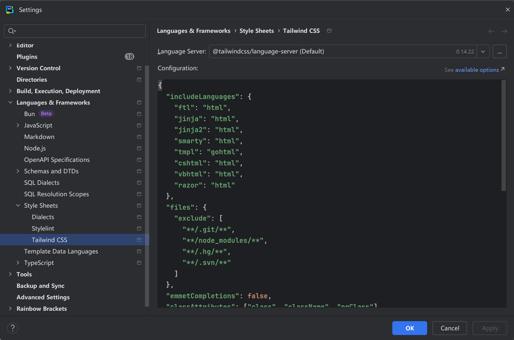

# Tailwind [v4.1]

### 作者: -- 天气预报

### 日期: -- 2025-09-20

## 01. 官网

> === https://tailwindcss.com/

- **ui**

> [!note]
>
> - [x] Tailwind (v4.1) 推荐新项目直接使用即可

### 1.1 文档

> === https://tailwindcss.com/docs/installation/using-vite

- **ui**

- **ui**

### 1.2 在线运行

> === https://play.tailwindcss.com/

- **ui**

### 1.3 福利课程

> === https://tailwindcss.com/course

- [x] 邮件报名、邮件推送油管视频 [科学上网] (* 小课程、分享特殊场景案例实现)

### 1.4 模版服务

> === https://tailwindcss.com/plus/templates?ref=sidebar

- **ui**

### 1.5 组件

> === https://tailwindcss.com/plus/ui-blocks?ref=sidebar

- [x] 免费

- **ui**

- **ui**

### 1.6 博客

> === https://tailwindcss.com/blog

- **ui**

### 1.7 插件

> === https://tailscan.com/

- **ui**

> === Tailscan Core | Tailscan Core + AI

- **ui**

- **ui**

- **ui**

## 02. 环境

> === https://tailwindcss.com/docs/installation/using-vite

- **ui**

### 2.1 CDN

> === https://tailwindcss.com/docs/installation/play-cdn

- **index.html**

~~~html
<!DOCTYPE html>
<html lang="en">
    <head>
        <meta charset="UTF-8">
        <title>Tailwind</title>
        
        
    </head>
    <body>
        

            <h1 class="text-2xl text-center text-white">tailwind</h1>
        

    </body>
</html>
~~~

### 2.2 Tailwind CLI

> === https://nodejs.org/zh-cn

- **ui**

> === https://tailwindcss.com/docs/installation/tailwind-cli

- **npm**

~~~apl
npm init --yes

npm install tailwindcss @tailwindcss/cli
~~~

- **src/input.css**

~~~css
@import "tailwindcss";
~~~

- **src/index.html**

~~~html
<!DOCTYPE html>
<html lang="en">
    <head>
        <meta charset="UTF-8">
        <title>Tailwind</title>
        <link rel="stylesheet" href="./output.css">
    </head>
    <body>
        

            <h1 class="text-2xl text-center text-white">tailwind</h1>
        

    </body>
</html>
~~~

- **npx**

~~~apl
npx @tailwindcss/cli -i ./src/input.css -o ./src/output.css --watch
~~~

### 2.3 Next

> === https://nextjs.org/

- [x] 内置安装引导支持、仅需创建项目时选中即可

- **npm**

~~~apl
npx create-next-app@latest
~~~

- **console**

~~~apl
# 项目名称
1. What is your project named? [name]

# 是否安装 TypeScript
2. Would you like to use TypeScript? [No / Yes]

# 是否安装 ESLint 代码检查工具
3. Which linter would you like to use? [ESLint / Biome / None]

# 是否安装 Tailwind
4. Would you like to use Tailwind CSS? No / Yes

# 是否需要 src 作为项目源代码存放目录
5. Would you like your code inside a `src/` directory? [No / Yes]

# 是否安装 文件路由系统
6. Would you like to use App Router? (recommended) [No / Yes]

# 是否安装 Turbopack 打包构建工具
7. Would you like to use Turbopack? (recommended) [No / Yes]

# 是否配置 @/* 别名 模块导入方式
8. Would you like to customize the import alias (`@/*` by default)? [No / Yes]

# 配置别名 是否使用 @/*
9. What import alias would you like configured? @/*
~~~

- **page.tsx**

~~~tsx
export default function Page() {
    return (
        

            <h1 className="text-2xl text-white text-center">tailwind</h1>
        

    )
}
~~~

### 2.4 Vite React

> === 请认真学习本节示例过程、后续示例基于此环境、本环境无须掌握 React

#### 2.4.1 init

> === npm init --yes

- **package.json**

~~~json
{
    "name": "tailwind",
    "version": "1.0.0",
    "scripts": {
        "test": "echo \"Error: no test specified\" && exit 1"
    },
    "keywords": [],
    "author": "",
    "license": "ISC",
    "description": "",
    "type": "module"
}
~~~

#### 2.4.2 react

> === npm install react react-dom

- **package.json**

~~~json
{
    "name": "tailwind",
    "version": "1.0.0",
    "main": "index.js",
    "scripts": {
        "test": "echo \"Error: no test specified\" && exit 1"
    },
    "keywords": [],
    "author": "",
    "license": "ISC",
    "description": "",
    "type": "module",
    "dependencies": {
        "react": "^19.1.1",
        "react-dom": "^19.1.1"
    }
}
~~~

#### 2.4.3 vite

> === npm install vite -D

- **package.json**

~~~json
{
    "name": "tailwind",
    "version": "1.0.0",
    "main": "index.js",
    "scripts": {
        "test": "echo \"Error: no test specified\" && exit 1"
    },
    "keywords": [],
    "author": "",
    "license": "ISC",
    "description": "",
    "type": "module",
    "dependencies": {
        "react": "^19.1.1",
        "react-dom": "^19.1.1"
    },
    "devDependencies": {
        "vite": "^7.1.6"
    }
}
~~~

#### 2.4.4 plugin-react

> === https://cn.vite.dev/plugins/

- [x] npm install @vitejs/plugin-react     -D
- [x] npm install @vitejs/plugin-react-swc -D  [https://swc.rs/ ]

- **package.json**

~~~json
{
    "name": "tailwind",
    "version": "1.0.0",
    "main": "index.js",
    "scripts": {
        "test": "echo \"Error: no test specified\" && exit 1"
    },
    "keywords": [],
    "author": "",
    "license": "ISC",
    "description": "",
    "type": "module",
    "dependencies": {
        "react": "^19.1.1",
        "react-dom": "^19.1.1"
    },
    "devDependencies": {
        "@vitejs/plugin-react-swc": "^4.1.0",
        "vite": "^7.1.6"
    }
}
~~~

#### 2.4.5 vite.config.js

> === 项目根目录创建 vite.config.js 文件

- **vite.config.js**

~~~js
import { defineConfig } from "vite";
import react from "@vitejs/plugin-react-swc";

export default defineConfig({
    plugins: [
        react(),
    ]
})
~~~

#### 2.4.6 index.html

> === 项目根目录创建文件 index.html

~~~html
<!DOCTYPE html>
<html lang="en">
    <head>
        <meta charset="UTF-8">
        <title>React</title>
    </head>
    <body>
        

        
    </body>
</html>
~~~

#### 2.4.7 src/main.jsx

> === 项目根目录创建目录及文件 src/app.jsx | src/main.jsx

- **src/app.jsx**

~~~jsx
export function App() {
    return (
        
react

    )
}
~~~

- **src/main.jsx**

~~~jsx
import { createRoot } from "react-dom/client";
import { App } from "./app.jsx";

const root = document.getElementById("root");

createRoot(root).render(<App/>);
~~~

- **package.json**

~~~json
{
    "name": "tailwind",
    "version": "1.0.0",
    "scripts": {
        "dev": "vite dev"
    },
    "keywords": [],
    "author": "",
    "license": "ISC",
    "description": "",
    "type": "module",
    "dependencies": {
        "react": "^19.1.1",
        "react-dom": "^19.1.1"
    },
    "devDependencies": {
        "@vitejs/plugin-react-swc": "^4.1.0",
        "vite": "^7.1.6"
    }
}
~~~

- **npm**

~~~apl
npm run dev # http://localhost:5173/
~~~

#### 2.4.8 tailwind

> === npm install tailwindcss @tailwindcss/vite -D

- **package.json**

~~~json
{
    "name": "tailwind",
    "version": "1.0.0",
    "scripts": {
        "dev": "vite dev"
    },
    "keywords": [],
    "author": "",
    "license": "ISC",
    "description": "",
    "type": "module",
    "dependencies": {
        "react": "^19.1.1",
        "react-dom": "^19.1.1"
    },
    "devDependencies": {
        "@tailwindcss/vite": "^4.1.13",
        "@vitejs/plugin-react-swc": "^4.1.0",
        "tailwindcss": "^4.1.13",
        "vite": "^7.1.6"
    }
}
~~~

- **vite.config.js**

~~~js
import { defineConfig } from "vite";
import react from "@vitejs/plugin-react-swc";
import tailwindcss from "@tailwindcss/vite";

export default defineConfig({
    plugins: [
        react(),
        tailwindcss(),
    ]
})
~~~

- **src/globals.css**

~~~css
@import "tailwindcss";
~~~

- **src/main.jsx**

~~~jsx
import { createRoot } from "react-dom/client";
import { App } from "./app.jsx";
import "./globals.css";

const root = document.getElementById("root");
createRoot(root).render(<App/>)
~~~

- **src/app.jsx**

~~~jsx
export function App() {
    return (
        

            <h1 className="font-mono text-center text-white">
                
                    tailwind
                
            </h1>
        

    )
}
~~~

## 03. 开发工具

> === https://tailwindcss.com/docs/editor-setup

### 3.1 IDE

- **ui**

> === WebStorm 内置 Tailwind Language Server 语言服务引擎

- [x] 推荐最新版本: https://www.jetbrains.com/webstorm/download/other.html
- [x] 引擎自动开启、无需其它配置、可自动提示 Tailwind、可检测类选择器

- **ui**

- **ui**

### 3.2 格式化

> === https://github.com/tailwindlabs/prettier-plugin-tailwindcss

- **ui**

- **npm**

~~~apl
npm install prettier prettier-plugin-tailwindcss -D
~~~

- **prettier.config.js**

~~~js
export default {
	plugins: ["prettier-plugin-tailwindcss"],
}
~~~

- **npx**

~~~apl
npx prettier . --write
~~~

> === 推荐人为控制书写顺序 [位置 | 盒子模型 | 排版 | 视觉 | 其它]

- **src/app.jsx**

~~~jsx
export function App() {
    return (
        

            

                

            

        

    )
}
~~~

> [!note]
>
> - [x] https://codeguide.bootcss.com/

- **ui**

### 3.3 兼容性

> === https://tailwindcss.com/docs/compatibility

- **ui**

## 04. 样式初始化

> === https://tailwindcss.com/docs/preflight

### 4.1 modern-normaliz

> === https://github.com/sindresorhus/modern-normalize

- [x] Tailwind 使用 modern-normaliz 初始化 HTML 及常用元素样式初始化
- [x] node_modules/tailwindcss/preflight.css

- **ui**

- **preflight.css**

~~~css
*,
::after,
::before,
::backdrop,
::file-selector-button {
    box-sizing: border-box;
    margin: 0;
    padding: 0;
    border: 0 solid;
}

h1,
h2,
h3,
h4,
h5,
h6 {
    font-size: inherit;
    font-weight: inherit;
}

img,
svg,
video,
canvas,
audio,
iframe,
embed,
object {
    display: block; /* 1 */
    vertical-align: middle; /* 2 */
}
~~~

### 4.2 @layer

> === Tailwind 内置 theme | base | components | utilities 分层全局管理样式

- **globals.css**

~~~css
@import "tailwindcss";
~~~

- **globals.css**

~~~css
@layer theme, base, components, utilities;

@import "tailwindcss/theme.css" layer(theme);
@import "tailwindcss/preflight.css" layer(base);
@import "tailwindcss/utilities.css" layer(utilities);
~~~

### 4.3 @layer theme

> === 主题层定义 Tailwind 内置各种全局变量、颜色、动画、间距 等 ...

- **node_modules/tailwindcss/theme.css**

~~~css
@theme default {
    
    --color-red-50: oklch(97.1% 0.013 17.38);
    --color-red-100: oklch(93.6% 0.032 17.717);
    --color-red-200: oklch(88.5% 0.062 18.334);
    --color-red-300: oklch(80.8% 0.114 19.571);
    --color-red-400: oklch(70.4% 0.191 22.216);
    --color-red-500: oklch(63.7% 0.237 25.331);
    --color-red-600: oklch(57.7% 0.245 27.325);
    --color-red-700: oklch(50.5% 0.213 27.518);
    --color-red-800: oklch(44.4% 0.177 26.899);
    --color-red-900: oklch(39.6% 0.141 25.723);
    --color-red-950: oklch(25.8% 0.092 26.042);

    --blur-xs: 4px;
    --blur-sm: 8px;
    --blur-md: 12px;
    --blur-lg: 16px;
    --blur-xl: 24px;
    --blur-2xl: 40px;
    --blur-3xl: 64px;
    
    --spacing: 0.25rem; // html 16px * 0.25 ==> 4px
                        //              w-5 ==> width: 20px
                        //              p-5 ==> padding: 20px

    @keyframes spin {
        to {
            transform: rotate(360deg);
        }
    }

    --animate-spin: spin 1s linear infinite;

    ...
    
}
~~~

- **node_modules/tailwindcss/index.css**

~~~css
@layer theme, base, components, utilities;

@layer theme {
    @theme default {
        ...
        --color-red-100: oklch(93.6% 0.032 17.717);
        --color-red-200: oklch(88.5% 0.062 18.334);
        --color-red-300: oklch(80.8% 0.114 19.571);      
        ...
    }
}
~~~

- **globals.css**

~~~css
@import "tailwindcss";

@theme {
    --font-serif: ui-sans-serif, system-ui, sans-serif;
}
~~~

### 4.4 @layer base

> === 完成 HTML 样式初始化、全局样式默认内外边距、盒子模型 等 ...

- **node_modules/tailwindcss/index.css**

~~~css
@layer theme, base, components, utilities;

@layer theme {
    ...
}

@layer base {
    *,
    ::after,
    ::before,
    ::backdrop,
    ::file-selector-button {
    	box-sizing: border-box; /* 1 */
        margin: 0; /* 2 */
        padding: 0; /* 2 */
        border: 0 solid; /* 3 */
    }
    
    ...
}
~~~

- **globals.css**

~~~css
@import "tailwindcss";

@layer base {
    h1 {
        font-size: 36px;
    }
}
~~~

### 4.5 @layer utilities

> === utilities 表示内置程序类 p-5 | pt-2 | text-white 等 ... [通过解析生成]

- [x] @layer utilities 应当定义 Tailwind 还没有内置的实用程序类

- **node_modules/tailwindcss/index.css**

~~~css
@layer theme, base, components, utilities;

@layer theme {
    ...
}

@layer base {
    *,
    ::after,
    ::before,
    ::backdrop,
    ::file-selector-button {
    	box-sizing: border-box; /* 1 */
        margin: 0; /* 2 */
        padding: 0; /* 2 */
        border: 0 solid; /* 3 */
    }
    
    ...
}

@layer utilities {
	@tailwind utilities;
}
~~~

- **node_modules/tailwindcss/utilities.css**

~~~css
@tailwind utilities;
~~~

- **globals.css**

~~~css
@import "tailwindcss";

@utility animmate-paused {
    animation-play-state: paused;
}

@utility animmate-delay-1500 {
    animation-delay: 3000ms;
}

@utility animmate-delay-3000 {
    animation-delay: 3000ms;
}
~~~

### 4.5 @layer components

> @layer components {} 层是预留给开发者编写的自定义类、在入口文件编写

- **src/globals.css**

~~~css
@import "tailwindcss";

@layer components {
    .btn {
        @apply px-3 py-2 bg-rose-500 text-white;
    }

    .btn-developer {
        background-color: blue;
        padding: 10px;
        color: white;
    }
}
~~~

> [!note]
>
> - [x] @components 自定义类选择器、不具有任何特殊性、也不可 hover:btn 方式使用
> - [x] utilities   视作为 Tailwind 自身的一部分、可 hover:animmate-paused 使用

## 05. 核心机制

> === https://tailwindcss.com/docs/styling-with-utility-classes

- **ui**

### 4.1 规则

> === 通常一个 css property 对应一个类选择器、采用 [属性 + 对应值] 方式

- [x] p-5         ==> padding: 20px;
- [x] mt-5        ==> margin-top: 20px;
- [x] text-white  ==> color: white;
- [x] bg-white    ==> background-color: white;

> [!note]
>
> - [x] 原子选择器 有更高的重复利用率、减少打包体积 如 p-5 可反复独立使用
> - [x] 原子选择器 避免大量的自定义类选择器增加命名负担、结构控制负担、避免优先级问题
> - [x] 原子选择器 易于开发者之间、社区之间进行样式复制
> - [x] 原子选择器 带有轻微的人为公共语义、极易在开发者之间达成心智共识
>
> - [x] 内联选择器 属性及值需完整给出、较多属性会使得声明较长
> - [x] 内联选择器 难以肉眼可见理解属性值含义
> - [x] 内联选择器 无法完成 hover 聚焦、媒体查询、等浏览器交互效果

#### 4.1.1 内联样式

> === Tailwind 主张特殊情况使用内联样式、如条件变量拼接样式、没有内置的实用类

- **src/app.jsx**

~~~jsx
export function App() {

    const styles = {
        backgroundImage: "linear-gradient(#fff 1px, transparent 1px), linear-gradient(to right, #fff 1px, transparent 1px)",
        backgroundSize: "20px 20px",
        backgroundPosition: "center center"
    };

    return (
        

            

                

                    
Tailwind

                

            

        

    )
}

~~~

#### 4.1.2 样式重复

> === 可采用 循环 | 列编辑 | 抽象组件 等思考控制样式重复

- **src/app.jsx**

~~~jsx
export function App() {

    return (
        

            

                <button className="px-5 py-3 text-white bg-purple-700 cursor-pointer">tailwind</button>
                <button className="px-5 py-3 text-white bg-purple-700 cursor-pointer">react</button>
                <button className="px-5 py-3 text-white bg-purple-700 cursor-pointer">motion</button>
                <button className="px-5 py-3 text-white bg-purple-700 cursor-pointer">next</button>
                <button className="px-5 py-3 text-white bg-purple-700 cursor-pointer">zustand</button>
            

        

    )
}
~~~

- **src/app.jsx [loop]**

~~~jsx
export function App() {

    const titles = [
        "tailwind",
        "react",
        "motion",
        "next",
        "zustand",
    ];

    return (
        

            

                {
                    titles.map((title) => (
                        <button className="px-5 py-3 text-white bg-purple-700 cursor-pointer"
                                key={ title }>
                            { title }
                        </button>
                    ))
                }
            

        

    )
}
~~~

> === 列编辑 [ALT + SHIFT + ALT]

- **ui**

> === 抽象组件

- **src/app.jsx**

~~~jsx
function Button({ title }) {
    return (
        <button className="px-5 py-3 text-white bg-purple-700 cursor-pointer">
            { title }
        </button>
    )
}

export function App() {
    return (
        

            

                <Button title={ "tailwind" }/>
                <Button title={ "react" }/>
                <Button title={ "motion" }/>
                <Button title={ "next" }/>
                <Button title={ "zustand" }/>
            

        

    )
}
~~~

- **src/app.jsx**

~~~jsx
function Button({ title }) {
    return (
        <button className="px-5 py-3 text-white bg-purple-700 cursor-pointer">
            { title }
        </button>
    )
}

export function App() {

    const titles = [
        "tailwind",
        "react",
        "motion",
        "next",
        "zustand",
    ];

    return (
        

            

                {
                    titles.map((title) => (
                        <Button title={ title } key={ title }/>
                    ))
                }
            

        

    )
}
~~~

## 06. 盒子大小

## 07. 背景

## 08. 间距

## 09. 弹性网格

## 10. 布局

## 11. 排版

## 12. 边框

## 13. 效果

## 14. 移动

## 15. 过渡动画

## 16. 互动

## 17. 表格

## 18. 作用

## 19. SVG
